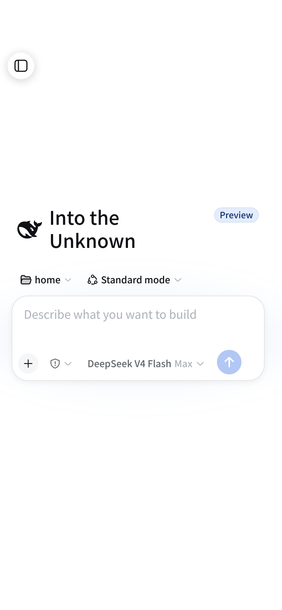
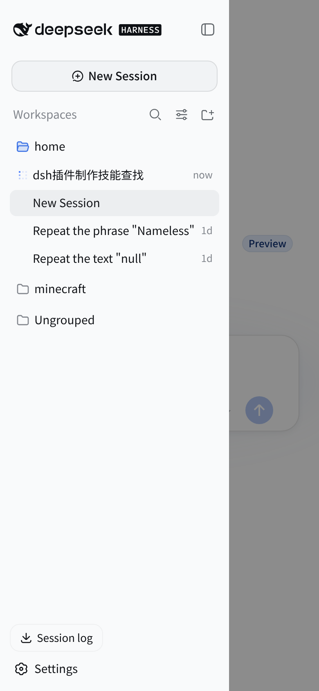

<p align="center">
  
</p>

# dsh-mobile-nav

**让 DeepSeek Harness Web UI 在手机上真正可用**——窄屏(< 1024px)下隐藏左侧 rail,目录变成 overlay 抽屉,会话区独占全宽。纯 client 插件,宽屏(≥1024px)下与未安装时完全一致。

[](package.json)
[](LICENSE)
[](cordis.patch.yml)
[](README.md)

## 为什么需要它

官方布局在窄屏下把左侧边栏折叠成一条 56px 的图标 rail,展开目录时又挤压中间会话列——手机上几乎没有可用宽度。本插件在窄屏下重新组织整个界面:

| 会话主页(全宽) | 目录抽屉(overlay) |
| --- | --- |
|  |  |

## 特性

### 会话全宽,目录变抽屉

网格改为 `1fr 0 0`,侧边栏脱离 grid 流成为左侧抽屉,压在会话之上而不是挤压它;抽屉宽度严格贴合侧栏内容(`max-content`,约 280px),不产生白边;抽屉关闭态 `translateX(-110%)` 完全移出视口,主界面左侧无阴影、无残留。

### 避开摄像头

不做顶部预留空间(应用仍从视口顶端开始)。打开目录的浮动按钮放在**左侧边缘 y=72px**(摄像头带之下、hero 输入卡之上),不会被刘海/挖孔/状态栏挡住。

### 会话头部重排

移动端头部按 [目录按钮] [会话名称] [模式徽标] 排列;大块的 **Session log 胶囊从头部移除**,移到抽屉底部(Settings 旁),复用官方 `ctx.sessionLogDownload` 下载逻辑,进度/结果弹窗与桌面端一致。

### 设置界面移动端适配

官方 800px 双栏设置弹窗在手机上改为**近全宽 sheet**(`calc(100vw - 16px)`、左缘 8px、高度自适应内容、上限 800px):

- 导航标签两行排列全部可见(隐藏冗余标题,不再横向滚动截断);
- 工具栏左右分散:Open configuration file 靠左、圆形关闭按钮靠右;
- 设置条目保持横向布局,Appearance 三卡片压缩为一行;
- 打开时淡入 + 轻微上移/缩放动画,`prefers-reduced-motion` 下自动禁用;
- 导出会话对话框保持官方居中卡片,限制 `max-width` 防溢出;
- Escape 只关设置、不误关抽屉。

| 设置界面(近全宽 sheet) |
| --- |
|  |

### 正文排版与输入框

- 会话消息文字 16px → 15px、左右留白 32px → 20px,行宽更充分;左侧抽屉历史栏与输入框文字不受影响;
- 输入框底栏:agent 权限胶囊(盾牌)与模型名不再重叠(权限胶囊保持自然宽,模型胶囊允许收缩)。

## 安装

DSH 插件通过 `dsh plugin` 命令安装进 **profile**(`dsh web` 对应 `web` profile)。

### 方式一:从 GitHub 安装(推荐,一条命令)

```sh
dsh plugin --profile web add github:<owner>/<repo>
```

- 仓库**自带构建产物**(`lib/`),无 `prepare` 脚本——安装不执行任何第三方代码,不受 pnpm ≥10 的 `allowBuilds` 拦截,无需修改任何配置;
- 装完重启 `dsh web`;此后 client bundle 变更只需刷新页面。

### 方式二:本地开发(link)

```sh
dsh plugin --profile web add link:/path/to/dsh-mobile-nav
# 重启 profile 后生效
```

## 构建

```sh
pnpm install
pnpm build        # tsc host + tsc client + 内联打包 lib/client.js
```

> 产物 `lib/` 与源码一起入库(保证一键安装),改动源码后记得 `pnpm build` 再提交。

## 验证

- `pnpm verify` — 双 program 类型检查;
- 真实组合:`dsh --profile web --dump-config` 应出现插件层;
- 移动端(390px):rail 消失、中心列全宽、FAB 在安全区下方(y≥56px)、抽屉开合/遮罩/Escape、设置弹窗适配;
- 桌面端(≥1024px):外观与未安装时一致(官方 800px 双栏设置、头部 Session log 原样)。

## 兼容性

- 需要 `:has()` 支持(**Chromium 105+,2022**);
- `prefers-reduced-motion: reduce` 下自动禁用动画;
- 仅依赖框架稳定属性(`data-sidebar-collapsed`、`data-shell-overlay`、`data-side`、`data-phase`、`aria-modal`),不耦合 hash class(唯一例外:Appearance 卡片横排依赖官方 `_cubeRow` 类后缀)。

## License

[MIT](LICENSE)
